# Retail Executive Dashboard

A Power BI portfolio project built to turn retail transaction data into a manager-focused performance view.

The dashboard is designed for quick scanning and decision-making. It combines revenue, customer and cancellation analysis across monthly, quarterly and yearly reporting views.

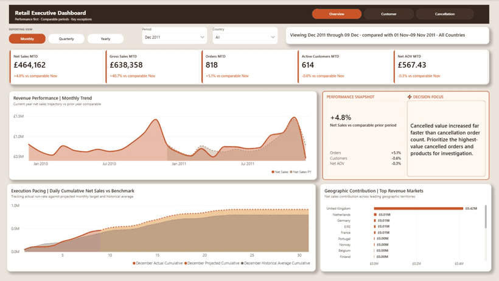

[▶ Watch the full dashboard demo](assets/demo/dashboard-demo.mp4)

## Dashboard Preview

### Executive Overview

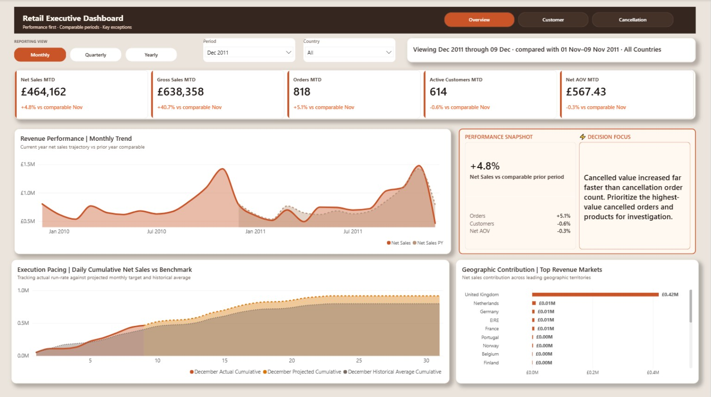

### Customer Intelligence

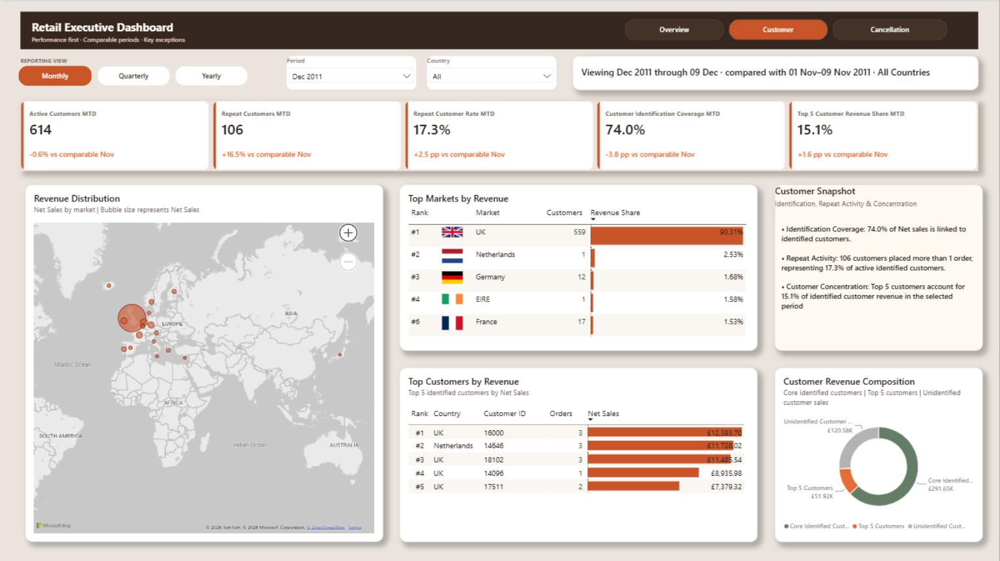

### Cancellation Analysis

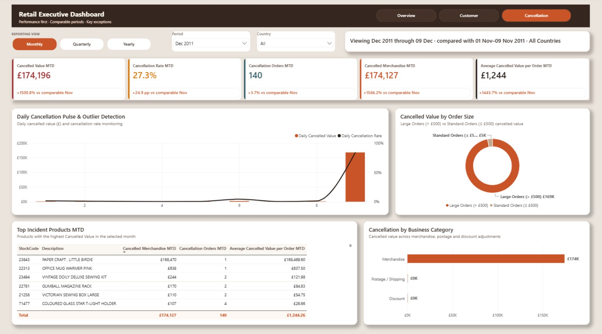

<details>
<summary><strong>Open the full dashboard gallery</strong></summary>

### Executive Overview Quarterly

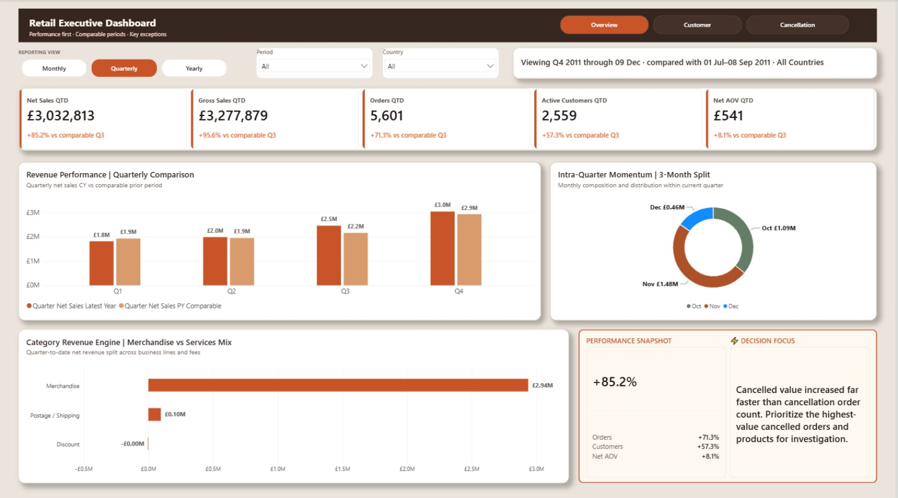

### Executive Overview Yearly

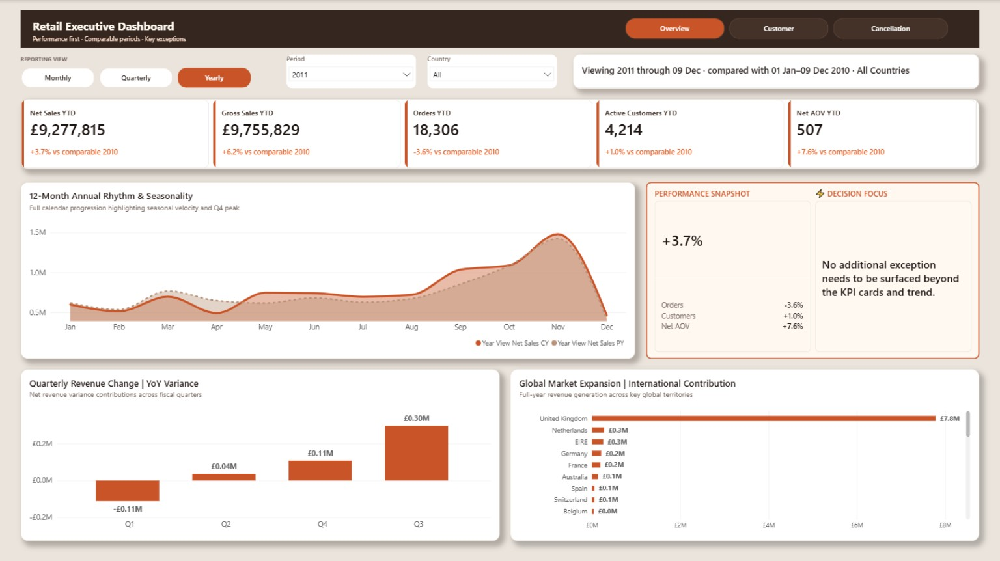

### Customer Intelligence Quarterly

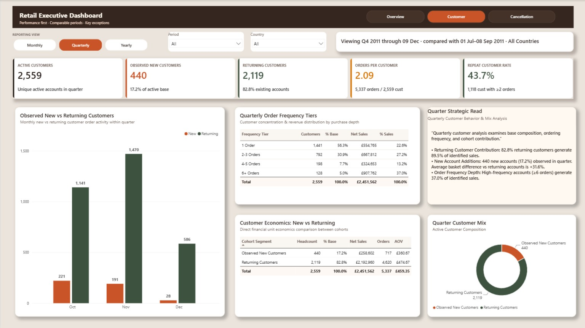

### Customer Intelligence Yearly

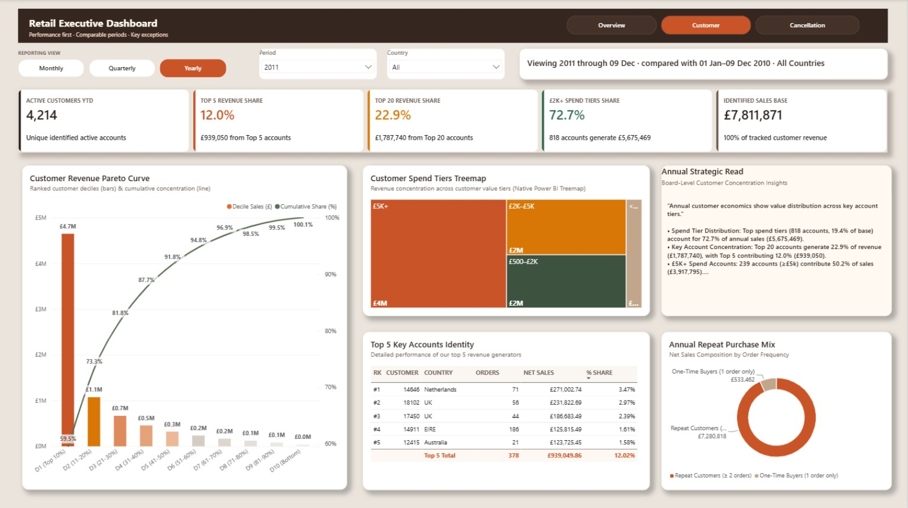

### Cancellation Analysis Quarterly

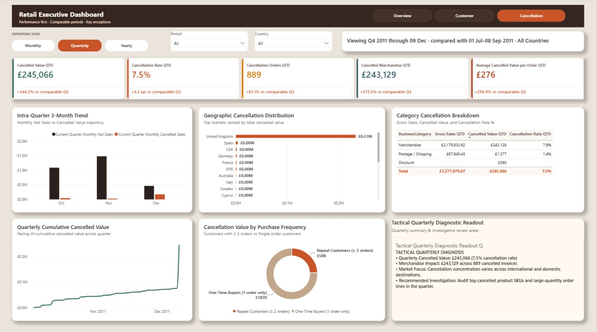

### Cancellation Analysis Yearly

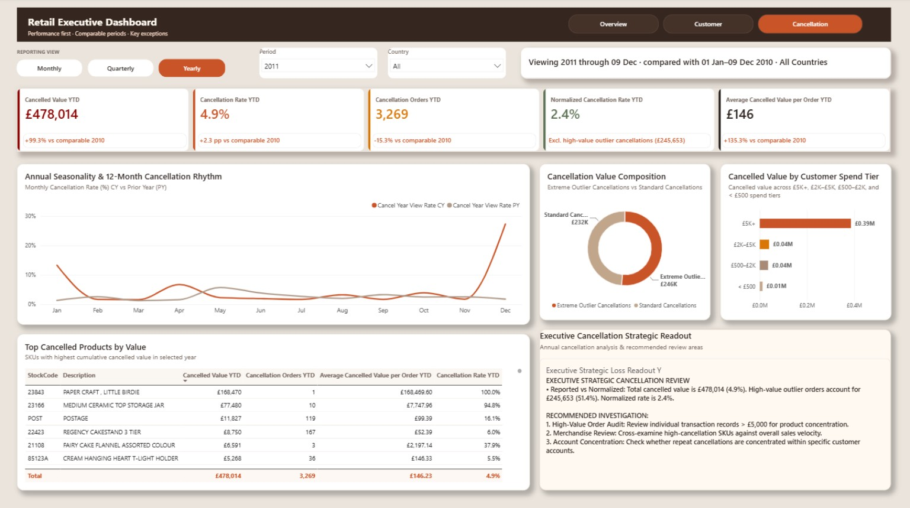

</details>

## Business Questions

This project focuses on a small set of management questions:

1. How is net sales performing against a comparable prior period?
2. Are order volume and customer activity supporting revenue growth?
3. Which markets and customers contribute most to revenue?
4. How concentrated is customer revenue?
5. Are cancellations becoming more material, and what is driving them?
6. Which exceptions require management attention first?

## Dashboard Structure

The report contains three analytical sections.

**Executive Overview**  
A management summary of sales, orders, customers, average order value, revenue trend, execution pacing and major geographic contributors.

**Customer Intelligence**  
Customer activity, repeat behavior, identification coverage, customer concentration, top customers and top markets.

**Cancellation Analysis**  
Cancellation value, cancellation rate, cancelled orders, average cancelled value per order, outlier detection, incident products and business category contribution.

Each section is available at Monthly, Quarterly and Yearly reporting levels, creating nine analytical pages in total.

## Example Management Findings

For the selected December 2011 month to date view through 09 December:

* Net Sales were approximately **£464K**, up **4.8%** versus the comparable November period.
* Orders increased **5.1%**, while Net AOV was broadly stable at **£567.43**.
* The United Kingdom represented approximately **90.31%** of selected period revenue.
* The top five markets represented approximately **97.63%** of selected period revenue.
* Customer identification coverage was **74.0%**.
* The top five identified customers represented **15.1%** of identified customer revenue.
* Cancellation value increased far faster than cancellation order count, highlighting a high-value cancellation exception requiring investigation.

These findings demonstrate how the dashboard supports exception-first management review rather than only descriptive reporting.

## Dataset Source

This project uses **Online Retail II** from the UCI Machine Learning Repository.

- **Creator:** Daqing Chen
- **Coverage:** 01 December 2009 to 09 December 2011
- **Original file:** `online_retail_II.xlsx`
- **License:** CC BY 4.0
- **DOI:** [10.24432/C5CG6D](https://doi.org/10.24432/C5CG6D)
- **Official source:** [UCI Machine Learning Repository — Online Retail II](https://archive.ics.uci.edu/dataset/502/online%2Bretail)

The raw Excel workbook is not redistributed in this repository.

## Data Flow

The original source is the **Online Retail II Excel workbook**.

Python was used upstream for data inspection and preparation, with the analytical input exported to Parquet. Power Query then applies the final source-specific preparation required by the validated report before the data enters the semantic model. The public repository focuses on the Power BI implementation rather than reproducing the upstream Python workflow.

```text
Online Retail II (Excel)
        ↓
Python preprocessing
        ↓
Parquet analytical input
        ↓
Power Query
        ↓
Power BI semantic model + DAX
        ↓
9-page management dashboard
```

The portfolio focus is the validated Power BI solution: data modeling, DAX, time intelligence, management analysis, interaction design and report presentation.

## Semantic Model

The core reporting model uses `fact_sales` at transaction-line level with four directly related dimensions. Additional disconnected helper tables support period selection and analytical segmentation.

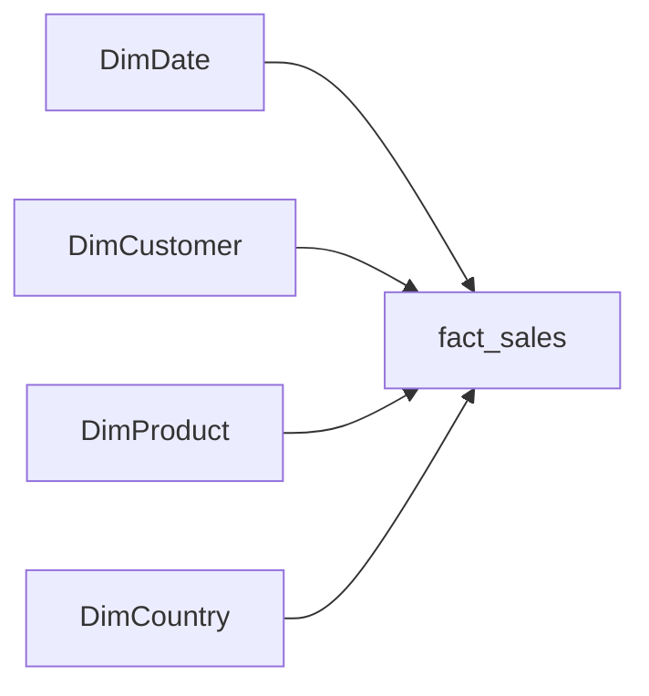

The main relationships use `InvoiceDate_Date`, `Customer ID`, `StockCode` and `Country` to keep report filtering predictable.

## Data and Business Logic

The semantic model separates sales, customers, countries, products and date-related logic into structured dimensions and measures.

Key reporting logic includes:

* Net Sales and Gross Sales separation
* Cancellation value and cancellation rate
* Active and repeat customer metrics
* Customer identification coverage
* Top customer and top market concentration
* Comparable period logic for partial reporting periods
* Monthly, quarterly and yearly reporting measures
* Ranking and share calculations that preserve report selections while avoiding incorrect Top N normalization

The December 2011 monthly view is a partial period through 09 December. Month over month comparisons therefore use 01 November through 09 November rather than comparing a partial month with a complete prior month.

## Tools Used

* Power BI Desktop
* DAX
* Power Query
* Power BI Project format and TMDL
* Python for upstream data preprocessing
* Parquet analytical input

## Repository Structure

```text
Retail.pbip
Retail.Report/
Retail.SemanticModel/
assets/
  demo/
  screenshots/
  theme/
data/
  README.md
.gitignore
README.md
```

Local Power BI cache and machine-specific settings are intentionally excluded from the repository.

## Data Source Setup

The PBIP source included in this repository does not expose the original local Windows path.

The prepared `fact_sales.parquet` file is intentionally not included in the public repository. It was produced from the original Online Retail II source through the upstream preparation described above. To refresh the semantic model locally, use a compatible `fact_sales.parquet` file and update the placeholder path in the `fact_sales` source definition.

See `data/README.md` for the local data setup note.

## Validation

The final portfolio version was checked at both static project level and in Power BI Desktop.

Validation covered:

* Top market ranking and revenue share context
* Country slicer behavior
* Cross page slicer synchronization
* Monthly, quarterly and yearly navigation
* KPI and visual consistency across the dashboard
* Revenue reconciliation between gross sales, cancellations and net sales
* Customer Top N share behavior
* PBIP structure and semantic model integrity

The public repository excludes internal QA artifacts and local Power BI runtime files.

## Project Goal

This project demonstrates practical Data Analyst and Business Intelligence work rather than only dashboard formatting.

The emphasis is on translating transaction data into a concise management view, validating business logic, identifying exceptions and presenting information in a form that supports faster decisions.

## Profile

**Thi Vu**  
Data & BI Analyst

LinkedIn: https://www.linkedin.com/in/thivu-data/  
GitHub: https://github.com/ThiVu-Data
